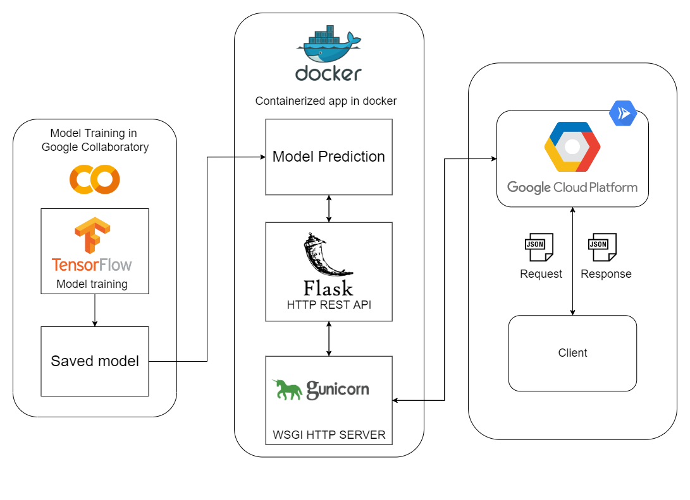
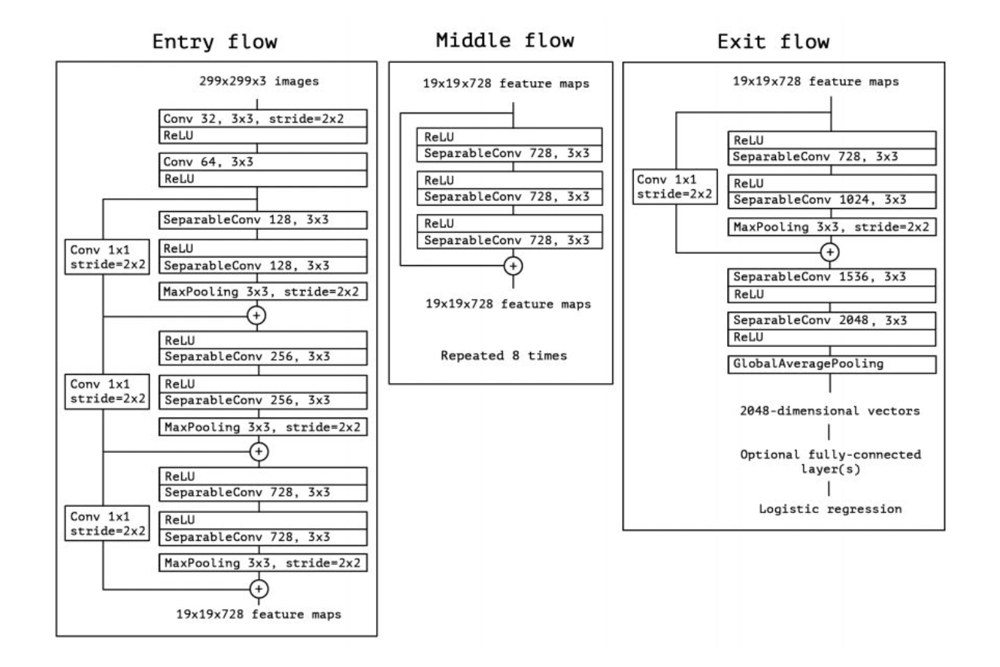

# Relic / Monument / Landmark Classifier for Dinara

Bangkit 2022 Capstone Project Classifier for Dinara. <br>

The models can currently classify only 29 classes but can be expanded in the
future. More info about relic / monument / landmark that can be classified can
be found in the notebooks.

## Application Architecture


## More Info on Model Creation
Note that we haven't published our dataset yet, but we are working on it

### Xception Architecture


### Notebook
<a target="_blank" href="https://colab.research.google.com/github/C22-PS186-Bangkit-2022-Capstone-Team/Relic-Classifier/blob/main/RelicClassifier.ipynb">
  
</a>

## Usage 

Usage is really straight up, you can either use our deployed model right away 
or deploy the model in your own Google Cloud Platform 
### Deploying Yourself
1. Create new Google Cloud project
2. Install Cloud Run API && Cloud Build API
3. Install and init Google Cloud SDK
4. Run commands below
```plaintext
gcloud builds submit --tag gcr.io/relic-classifier/index
gcloud run deploy --image gcr.io/relic-classifier/index --platform managed
```

after deploying model with steps above we simply
send a file using HTTP POST with 'imagefile' and the images itself as key value
pair and the deployed model sends back a JSON response containing the predicted image.

```py
import requests

resp = requests.post("https://getprediction-qyqf4nfema-et.a.run.app", files={'imagefile': open('./test/example_images/candi-borobudur.jpg', 'rb')})

print(resp.json())
```

or you can just use it locally by running 'main.py' and flask will run a local
server instead


```py
import requests

resp = requests.post("http://127.0.0.1:5000/", files={'imagefile': open('./test/example_images/candi-borobudur.jpg', 'rb')})

print(resp.json())
```